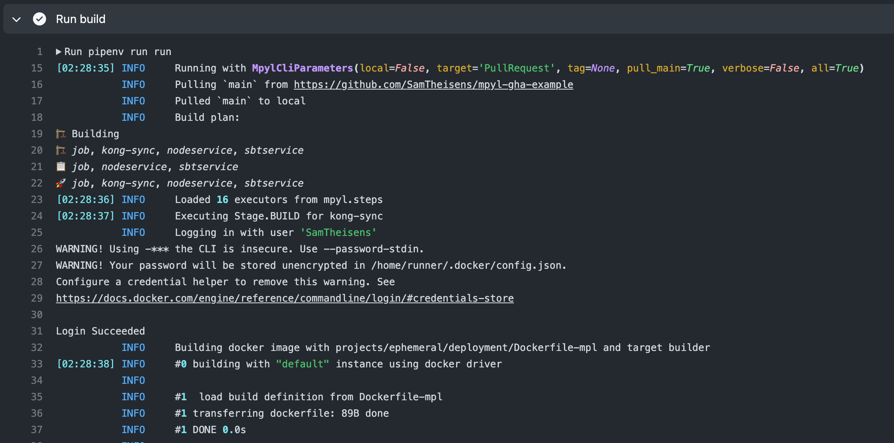

# mpyl-gha-example

Demonstrates the use of [MPyL](https://vandebron.github.io/mpyl/mpyl.html) with github actions as CI runner and ArgoCD as CD tool.

## Usage

1. Create a [./Pipfile](./Pipfile) with a dependency on MPyL
2. See [.github/workflows/build-mpyl-pipeline.yml](.github/workflows/build-mpyl-pipeline.yml) for an example of how to use MPyL in a github action

## Local deployment with ArgoCD

1. Follow the instructions to create a local cluster with [argocd](https://www.sokube.io/en/blog/gitops-on-a-laptop-with-k3d-and-argocd-en) until the section about 
   creating a sample application
2. Create a new application in argocd.
   This can be done via the argoCD gui `+ New app` -> `Edit as yaml` -> paste the contents of [argocd/application.yaml](argocd/application.yaml) -> `Create`
3. You can then deploy the application by clicking `Sync` in the argoCD gui